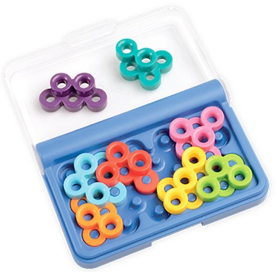
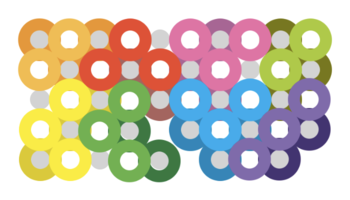
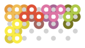
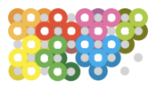
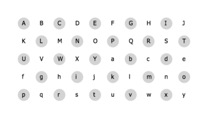
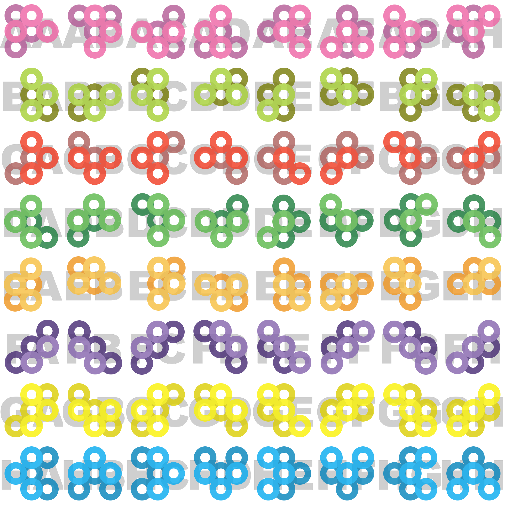

# COMP1110 Assignment 2

## Problem Description

The assignment involves implementing in Java an board game called [IQ-steps](http://www.smartgames.eu/en/smartgames/iq-steps)
made by the games developer [SmartGames](http://www.smartgames.eu/en).

#### Objective 

The game is a puzzle; the objective is to place all eight colored playing pieces
onto a board comprising 25 pegs which are arranged in a grid.  The placement must
ensure that all of the pieces fit together correctly.

A completed game:

The following sequence shows the progression of a solution to the game above.

#### Board

The game is played on a board comprised of 50 **locations** arranged
in a 5x10 grid.  25 of the locations have **pegs** which are the same
height as a single layer of the pieces (each of which are two layers
high, described below, and seen in the photo above).  The locations are encoded with letters A-Y
and a-y, according to the picture below and encoding scheme which is described below.  When
pieces are played, each ring in their lower layer must be on a peg and
as a consequence, each ring on their upper layer will be at a location
that is *not* a peg.

#### Pieces

The game comprises **8 playing shapes**, each of which is made of
plastic and consists of five or six flat rings arranged in **two
layers** (see the photo above).  Each layer has an arrangement of two
or three rings.  The thickness of the rings is the same as the height
of the board pegs, so once a piece is played, the upper layer of rings
always sits neatly above the top of the pegs.  The two layers of rings
are fused together.  The two layers are offset from each other by half
a peg space (rings are never directly on top another).  See the
illustration of all pieces and their possible orientatons below.  The
center-most ring is defined to be the **home** of the piece (the
placement of the piece is defined in terms of the placement of the
center ring).  Shapes may be flipped and rotated, so the home ring may
be on the top or bottom layer at the time it is played.  For
orientations A-D, the home ring is on the bottom layer.  For
orientations E-H, the home ring is on the top layer (see the illustration of all shapes and their eight orientations, below).

The illustration immediately below shows the state of the board after
placing three of the pieces from the completed game above.  For each
piece, the lower layer is shown as darker rings, and may be overlapped
by rings from the upper layer, including its own rings and rings from
other pieces.  Notice that the pink piece (shape `A`, placement `AHQ`)
had to be placed *after* the green piece (shape `B`, placement `BGS`)
because the top right of the upper layer of piece `A` (pink) overlaps
the top of the bottom layer of piece `B` (green).  Notice that
although the ordering of pieces `A` and `B` matters, the ordering of
the placement of pieces `A` (pink) and `E` (orange) does *not* matter
for this particular game, because those pieces have no
inter-dependencies in this particular arrangement of the pieces.

Notice that in this example, the first three pieces happen to have
been placed with their home ring on the top (light-colored) layer, so
their home is not located on a peg.  Their homes are locations `S`,
`Q`, and `B` (see the picture above for the locations, and you'll note
that these locations are not pegs).

Each piece can be **flipped** and **rotated** at 90 degree increments,
allowing for 8 different **orientations** (four rotations and a flip
with four rotations).  The following illustration shows all 64
possible combinations of the 8 pieces and 8 orientations.  The first
four columns show four rotations.  The piece is then flipped and
rotated four more times.  So the fifth image in the top row (`AE`)
illustrates the flip of the left-most image (`AA`).  Notice that for all
pieces in the rotations `A` to `D`,  the central home ring is on the bottom layer (dark color), but when
the pieces are flipped (`E` to `H`), the central home ring is on the top
layer (light).

#### Legal Piece Placements

For a piece placement to be valid, the following must be true:
* All rings must be placed on valid board locations (none of the rings may be off the board).
* Each of the bottom rings must be placed onto **vacant pegs** (pegs that are not occupied by already played pieces).
* None of the bottom rings may be **obstructed by the upper layer** of
  pieces already played.  Notice that for each peg, it may be
  obstructed by up to four upper-level locations.  For example, a
  piece being played onto peg `N` (see the diagram above), cannot be
  played if there are pieces with rings at upper locations `D`, `O`,
  `X`, or `M`.
* Each of the upper rings must be placed onto **vacant locations** (locations that are not occupied by already played pieces).

#### Encoding Game State

Game states are encoded as strings.  Your game will need to be able to
initialize itself using these strings and some of your tasks relate
directly to these strings.

##### Placement Strings

A placement string consists of between one and eight (inclusive)
**piece placements**. The placement string may not include any piece
twice.  A completed game consists of eight piece placements.  For
example, the game described above is characterized (when complete) by
the string `BGSAHQEFBGCgCDNHFlDAiFHn`.  Notice that this placement string is
carefully ordered, and constitutes a *legal playing sequence*.  Games
may also be represented in arbitrary orders, in which case they are
not encoding legal playing sequences.  One of your tasks will be to
take unordered game states and determine legal orderings, figuring out
the order in which pieces must be played in order for all placements
to be legal.

##### Piece Placement Strings

A piece placement string consists of three characters describing the location 
and orientation of one particular piece on the board:

* The first character identifies which of the eight shapes is being placed ('A' to 'H').
* The second character identifies which orientation the piece is in ('A' to 'E' for four rotations, and then 'F' to 'H' for four flipped rotations, see the illustration of all 64 piece orientations above).
* The third character identifies which location on the board the home of the piece is to be placed on ('A' to 'Y' represent the first 25 locations and 'a' to 'y' represent the next 25 locations), as depicted in the image above.

The image above shows the first and second characters for each of the pieces in
each of their orientations (64 in total). For example, at top left, 'AA' desribes piece 'A'
at orientation 'A'.  Below it, 'BA' describes piece 'B' at orientation 'A'.  At
the bottom right 'HH' describes piece 'H' at orientation 'H'.  And so on.

The progression of twelve images above shows the progression of the game `BGSAHQEFBGCgCDNHFlDAiFHn`,
starting with `BGS`, then showing `BGSAHQ`, etc.
